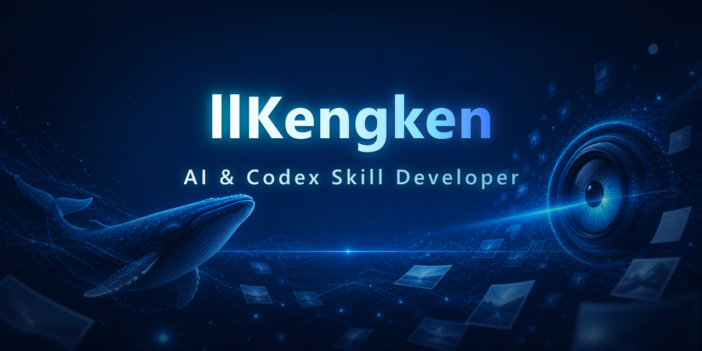
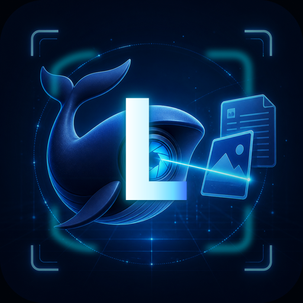

  

  

  

  
  
  
  
  
  
  

  

## 关于我

- 专注 DeepSeek 视觉能力与 Codex 技能开发
- 使用 Node.js 与 Python 构建 AI 工具链
- 维护开源技能、脚本与可复用工作流
- 喜欢把复杂能力封装成简单可靠的开发者体验

## 技能与技术栈

  
  
  
  
  
  
  

## 精选项目

  

## GitHub 统计

  
  

  

## 联系我

  
  

